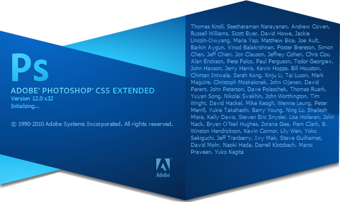

## I Am Not A Graphic Designer

Before I start this rant, I think it's only fair to tell you all that I am in no way a graphic designer. I love design, both print and web but I've never been good at creation.  This attack is not actually at Adobe Photoshop, which is obviously a great piece of software, but it is the now standard practice of web designers using Photoshop to create mock-ups and drafts before building their website.

My problem is simply that Photoshop is not the medium in which websites exist. Websites exist in web browsers and should be designed accordingly. Photoshop is often times an unnecessary step between your vision and an amazing website.

## I Am A Web Designer

While I'm not a big print designer, I do make websites for a living. I'm not just blowing steam here and I really do think you can efficiently run a web design business without making Photoshop mock-ups.

I'm not saying you should just jump in to a WordPress install and hope for the best. I believe in sketching, wire frames and information architecture. However, I think that all of these things can be done easily and more efficiently with pen and paper.  After sketching everything out, why waste your time making a function-less picture? Just go ahead and code your design. If your client wants something changed, go for it! Just don't make your job harder than it has to be.

## 37 Signals Agrees With Me

This really isn't meant as social proof or anything. I was just fully prepared to take this stance alone when I found this article:

[http://37signals.com/svn/posts/1061-why-we-skip-photoshop](http://37signals.com/svn/posts/1061-why-we-skip-photoshop)
