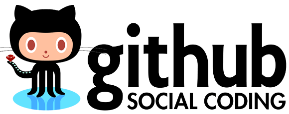

Github is a great tool for collaborating on software.

Over the last few years, people have thought of some really creative uses for the platform that go well beyond software collaboration. Here are a few of my favorites:

<!--more-->

<h2>1. <a href="https://github.com/collinjackson/guestlist" target="_blank">Guest Lists for Parties</a></h2>

I've seen this a few times now. Companies hosting tech parties will use a Github repo as their guest list. If people want to attend, the have to fork the repo, add their name to a list and submit a pull request.

I like this idea because I think submitting your first PR to github can be scary and this is an easy way to cross that hurdle.

<h2>2. <a href="https://github.com/ValveSoftware/steam-for-linux" target="_blank">Issue Tracking</a></h2>

Another great use of Github is it's issue tracking system. Valve Software uses a Github repo ( with no code in it ) just for user's to submit issues and get help. Issues can be tagged, commented on, seen by the public, and triaged / assigned if they result in a bug.

<h2>3. <a href="https://github.com/maxogden/messages" target="_blank">Personal Email</a></h2>

This one was new for me. <a href="https://twitter.com/maxogden">@maxogden</a> uses a Github repo in lieu of an email account. He asks that people open an issue in order to send a message and encrypt it with PGP if order to send a private message.

<h2>4. <a href="https://gist.github.com/ericelliott/d576f72441fc1b27dace" target="_blank">Living Documents</a></h2>

Github is also a great tool for creating 'living documents'. <a href="https://twitter.com/_ericelliott">@_ericelliott</a> uses Github ( and Gists ) to create documents that everyone can contribute to. This is great for 'everything you need to know about...' documents that can stay up to date and get better over time.

<h2>5. <a href="https://github.com/jsfest/oakland-cfp" target="_blank">Submitting Conference Talks</a></h2>

JSFest Oakland uses Github for its Call for Papers. If you want to submit a talk to the conference, open an issue and they'll tag it as 'accepted' if you make the cut!

<h2>6. <a href="https://github.com/getify/You-Dont-Know-JS" target="_blank">Writing a Book</a></h2>

<a href="https://twitter.com/getify">@getify</a> is publishing an entire JavaScript book series and using a Github repository to do so. The books are all on Github and the entire community is welcomed to submit changes or corrections via pull requests.
