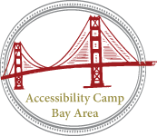

On Saturday, I attended my first ever [accessibility event](http://www.accessibilitycampbay.org/).

I heard about the event through my friend [@todd](https://twitter.com/todd) and it looked great so [@kng](https://twitter.com/kng) and I decided to go!

<!--more-->

## A bit of history

To be perfectly honest, before starting at Twitter, I had never even heard of Accessibility before. I had been told to use ALT text when creating images and I think I read a few posts where [@chriscoyier](https://twitter.com/chriscoyier) mentioned something called a screen reader but that was it.

I still remember the first time I saw something like this:

<pre class="language-markup"><code>&lt;span class="ProfileTweet-action--reply u-hiddenVisually">
    &lt;span class="ProfileTweet-actionCount" aria-hidden="true" data-tweet-stat-count="0">
        &lt;span class="ProfileTweet-actionCountForAria" >0 replies&lt;/span>
    &lt;/span>
&lt;/span>
&lt;span class="ProfileTweet-action--retweet u-hiddenVisually">
    &lt;span class="ProfileTweet-actionCount" aria-hidden="true" data-tweet-stat-count="0">
        &lt;span class="ProfileTweet-actionCountForAria" >0 retweets&lt;/span>
    &lt;/span>
&lt;/span>
&lt;span class="ProfileTweet-action--favorite u-hiddenVisually">
    &lt;span class="ProfileTweet-actionCount" aria-hidden="true" data-tweet-stat-count="0">
        &lt;span class="ProfileTweet-actionCountForAria" >0 favorites&lt;/span>
        &lt;/span>
&lt;/span>
&lt;div role="group" aria-label="Tweet actions" class="ProfileTweet-actionList u-cf js-actions"></code></pre>

aria-label? aria-hidden? I really had never heard of these before. Enter [ARIA](https://developer.mozilla.org/en-US/docs/Web/Accessibility/ARIA).

This just about brings you up to speed as to where I was at when I attended the conference. I knew there was a thing called web accessibility and I knew that there were ARIA attributes you could apply to your HTML to help make your websites more accessible.

## The Conference

In many ways, this was the best conference I've ever been to. It wasn't just the quality of the talks but the welcoming feeling and amazing community that really did it for me.

### Sign Language During Talks

I can't believe I've never seen this before at a tech conference, but the main room had an ASL interpreter for every talk. It seems like such a nice service to offer and I would love to see this at more conferences. Talks on accessibility are great but an actual accessible talk was awesome.

### Users, Not Just Developers

Some of the best talks I saw were not by engineers at all, but by users with various abilities. I think the best talk I saw was given by [@RainbowPoetess](https://twitter.com/RainbowPoetess) who does accessibility work at Google. She gave an amazing presentation including a video for how she uses the web with limited vision. It was really inspiring and reshaped how I think about designing websites.

### Where Does Accessibility Rank

Something I've been thinking about a lot since the conference is where to rate adding accessibility support to your web application against things like performance, new features and security.

Of course, ideally you would build an accessible performant app that is secure from the beginning, but that is rarely the way.

Especially in the startup world, you are often compromising due to time constraints. I'm still trying to work out for myself what constitutes the minimum amount of accessibility support apps *should* have.

### Accessibility in Interviews

The last thing that's been on my mind a great deal since the conference is making sure that wherever you work, your interview process is flexible enough to work with applicants with a wide range of abilities.

You should have some sort of plan for what tools and methods you would use to interview someone who can't see or hear. It's something I've never come across but at smaller companies I've worked for, I really don't think we were are prepared as we could have been.
