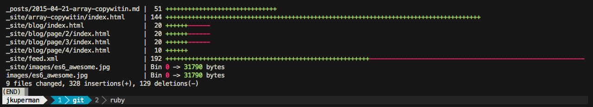
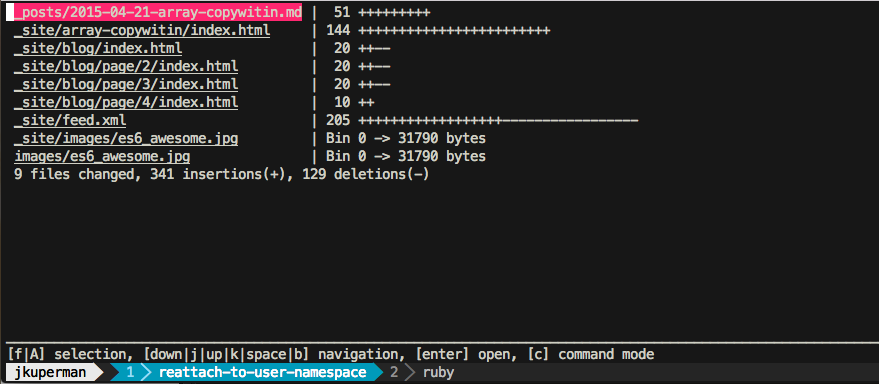
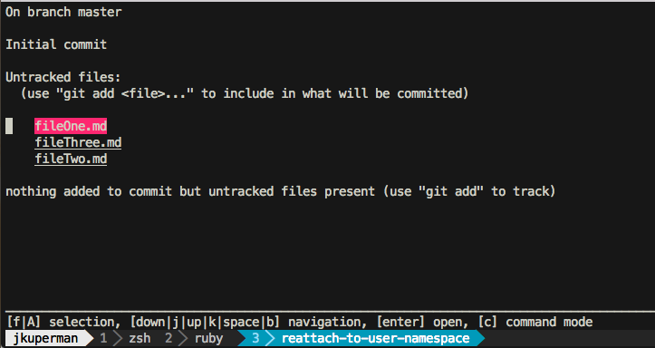
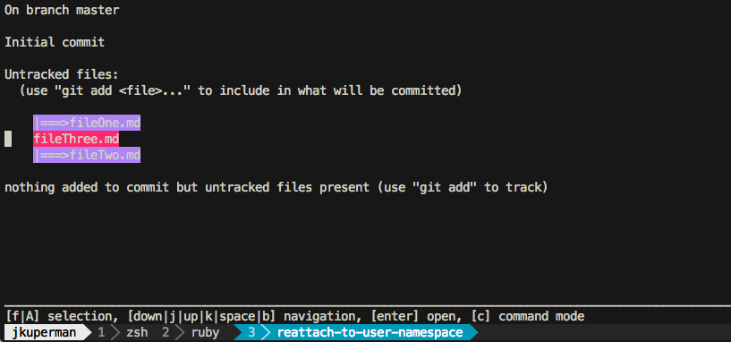
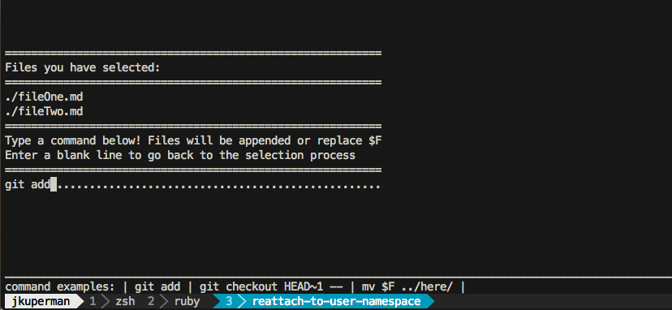
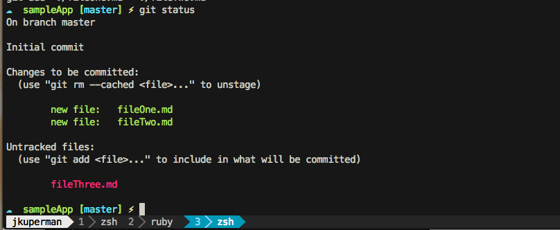

Facebook released a pretty [cool piece of open source software](http://facebook.github.io/PathPicker/) yesterday called [PathPicker](https://github.com/facebook/pathpicker/).

It's a command line tool that gives you a nice UI you can pipe lists of file names to and then act on them.

<!--more-->

## Explanation

Simply put, FPP is another shell utility like <code>ls</code>, <code>grep</code> and <code>git</code>. That's how it fits into your workflow. Let me pose a task that will be made easier with FPP.

> Say you wanted to list all the files in a current folder, select a few that looked interesting and open them up in your favorite editor to peek at.

Normally, I would use <code>ls</code> to list all the files. Then I would copy / paste or manually type the interesting looking ones into my editor. With FPP you can:

```bash
ls -la | fpp
```

and then select the interesting looking ones and hit enter. This is the sort of task FPP can help with, more examples to follow!

## Installation

You basically have two choices here, [Homebrew](http://brew.sh/) or pulling the repo from Github. It's just a command line script so it'll be easy!

### Homebrew

```bash
brew update; brew install fpp; fpp
```

### Github

```bash
cd /usr/local
git clone git@github.com:facebook/PathPicker.git
cd PathPicker/
ln -s $(pwd)/fpp /usr/local/bin/fpp
```

Then run <code>fpp</code> and you should be good to go!

## Usage

Now that we have it installed, let's check out some use cases!

Find an active git repo on your computer and change directory to it. First we'll run

```bash
git diff HEAD~1 --stat
```

And we should see something that looks like this: ( my last commit on this blog )



So let's pipe this output to PathPicker and see what we get!



This is pretty cool. It's an interactive ui that allows you to move through the changed files, select as many as you want and when you hit enter, it'll open them up in your system's default editor.

## Controls

The controls are pretty easy to get the hang of, they are as follows:

<table class="table table-striped">
    <tr>
        <th>Control</th>
        <th>Action</th>
    </tr>
    <tr>
        <td>&#8593; / k</td>
        <td>Move Up</td>
    </tr>
    <tr>
        <td>&#8595; / j</td>
        <td>Move Down</td>
    </tr>
        <tr>
        <td>A</td>
        <td>Select All</td>
    </tr>
    <tr>
        <td>f</td>
        <td>Select Highlighted</td>
    </tr>
    <tr>
        <td>enter</td>
        <td>Open</td>
    </tr>
    <tr>
        <td>c</td>
        <td>Command Mode</td>
    </tr>
</table>

## Command Mode

PathPicker is great for opening specific files, but that's not all it can do. Let's make a contrived example to show off this functionality.

> **Scenario** You've changed 3 files in your version controlled repository. You want to add only two of them to your next commit.

```bash
mkdir sampleApp
cd sampleApp
git init
touch fileOne.md
touch fileTwo.md
touch fileThree.md
git status | fpp
```

You should see something like



Now let's add the two files we want using the arrow keys to navigate and <code>f</code> to select. It should now look like this



Now we'll enter command mode with <code>c</code>. It should look like this



And voilà! Check to see that it worked with a simple <code>git status</code>. You should see



I'm sure there a million great uses for this tool. If you think of a cool one, let me know [on Twitter](https://twitter.com/jkup)
